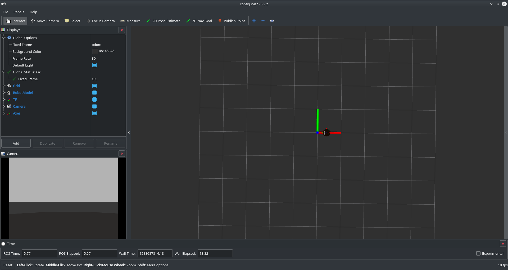
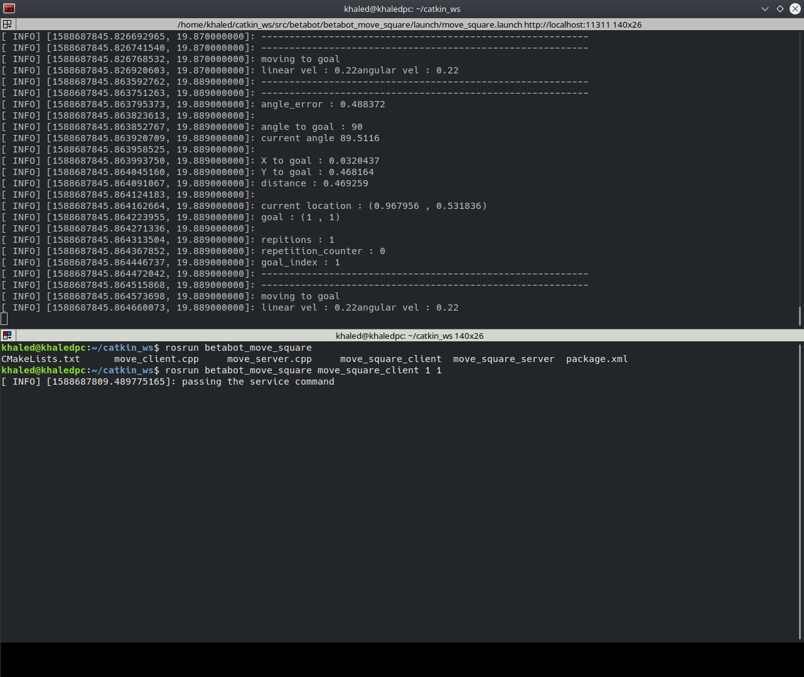

# Betabot Moving in Square

- [Betabot Moving in Square](#betabot-moving-in-square)
  - [Project Description](#project-description)
  - [GUIDE](#guide)
  - [After you implement the pkg state your reflection below](#after-you-implement-the-pkg-state-your-reflection-below)
    - [How did you plan the task?](#how-did-you-plan-the-task)
    - [What ROS REPs did you used?](#what-ros-reps-did-you-used)
    - [How we could increase the overall performance?](#how-we-could-increase-the-overall-performance)
    - [List the most time consuming problems you faced](#list-the-most-time-consuming-problems-you-faced)
  - [Demo](#demo)
  - [Screenshots](#screenshots)
      - [NAME: Khale Osama Abdelhamid](#name-khale-osama-abdelhamid)
      - [ID: 201600515](#id-201600515)

## Project Description 

Create a ROS package with custom service/action c++/python to move the betabot in gazebo, the movement
triggered will have to be a square, like in the image below:
Betabot movement Use the data passed to this topic /move_betabot_in_square_custom to change the way
betabot moves. Depending on the side value, the service must move the robot in a square
movement based on the side given. Also, the robot must repeat the shape as many times as
indicated in the repetitions variable of the message. Finally, it must return True if everything
went OK in the success variable.


## GUIDE

1. Create a new launch file, called start_betabot_move_custom_service_server.launch,
that launches the new betabot_move_custom_service_server.py file.
2. Test that when calling this new /move_betabot_in_square_custom service, betabot
moves accordingly. This means, the square is performed taking into account the side
and repetitions variables.
3. Create a new service client that calls the service /move_betabot_in_square_custom,
and makes betabot moves in a small square twice and in a bigger square once.
It will be called betabot_move_custom_service_client.py. The launch that starts it will
be called call_betabot_move_in_square_custom_service_server.launch.
4. Refer to this tutorial for more help.
The BetabotCustomServiceMessage.srv will be something like this:

```sh
float64 side # The distance of each side of the square
int32 repetitions # The number of times the betabot robot has to execute the square
movement when the service is called
---
bool success # Did it achieve it?
```

>NOTE: The side variable doesn’t represent the real distance along each size of the square.It’s just a variable that will be used to change the size of the square. The bigger the size variable is, the bigger the square performed by the robot will be. You can use any robot pkg.

>To make you project standout try another shape and to use filtered `odemtry` data.

---

## After you implement the pkg state your reflection below

### How did you plan the task?

I have made my goal into four points that the bot must go to given the currnet angle and the distance to the goal pint from the odomtry topic.when the bot reaches the goal point , the goal is switched to the next one and so on . put the points in a square position and multpily them with constant that corresponds to the side length and you will have a robot that moves in a square. the repitions is acieved by counting how many times you cycle through all the goals.

### What ROS REPs did you used?

1. I have used the naming conventions in the variables.
2. I have used the conventional file sturcture.
3. I have added all the possible nodes in a single launch file.


### How we could increase the overall performance?
I have tried to change the values of the velcity of the bot (the slower ,the better) along with increasing the tolerance distance and angle for the bot (if you make the goal too narrow the bot will have hard time trying to reach it). i have also increased the rate to which the robot chcks the odomtry so that i won't miss the state to which i have to switch to the goal

### List the most time consuming problems you faced

1. the odomtry angle and the angle the robot made reative to the goal was the most time consuming one. once the robot goes to the goal , the frame of reference changes and hence you have to make new cases for it.

2. the precision and tolerance amount that makes the robot behave normally but gives good accuracy at the same time.

3. due to to the inaccuracy of the odomotry it accumelates error ver time making the robot impossible to reach a certian goal after big amount of iterations (the longer it works the more prone it is to fail)
  
---

## Demo

[Demo](https://drive.google.com/file/d/16-jXkkOH6SR8BO8AhMV4I25K635WiM_s/view?usp=sharing)

## Screenshots





---

#### NAME: Khale Osama Abdelhamid
#### ID: 201600515

---
