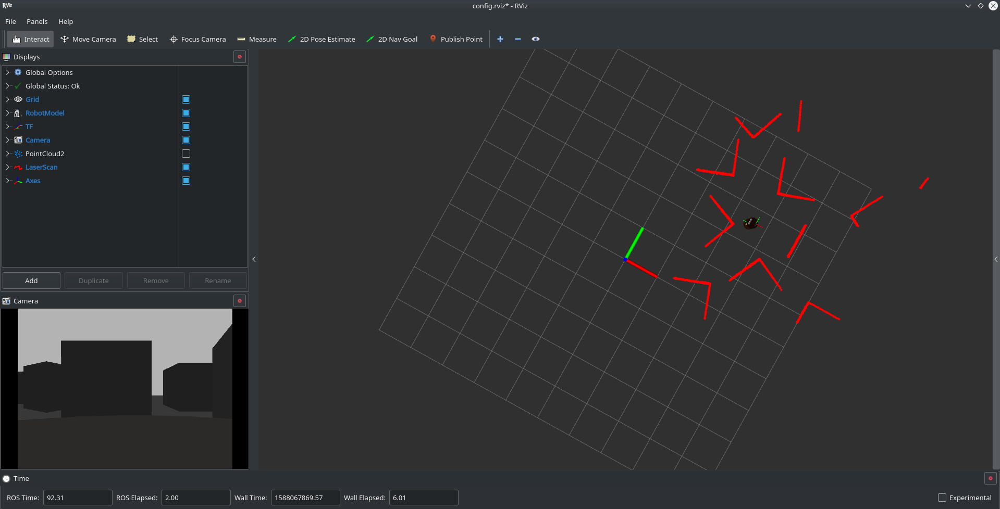

# Betabot Obstacle avoider

- [Betabot Obstacle avoider](#betabot-obstacle-avoider)
  - [Project Description](#project-description)
  - [After you implement the pkg state your reflection below](#after-you-implement-the-pkg-state-your-reflection-below)
    - [How did you plan the task?](#how-did-you-plan-the-task)
    - [what is your logic?](#what-is-your-logic)
    - [What ROS REPs did you used?](#what-ros-reps-did-you-used)
    - [How we could increase the overall performance?](#how-we-could-increase-the-overall-performance)
    - [List the most time consuming problems you faced](#list-the-most-time-consuming-problems-you-faced)
  - [2. making sure that the robot doesn't have any blind spots in front of him.](#2-making-sure-that-the-robot-doesnt-have-any-blind-spots-in-front-of-him)
    - [Demo](#demo)
    - [Screenshot](#screenshot)
      - [NAME:](#name)
      - [ID:](#id)

## Project Description 

Create a ROS package with custom nodes c++/python to move the
betabot randomly in gazebo, the movement should be triggered then the robot
moves randomly while avoid objects based on laser scans reading based on the laser
scans.

>NOTE: DON'T process one ray of the laser scans array or it will be considered ultrasonic/IR sensor.try to come up with approach thats use the laser full potential. 

>To make you project standout try not to visit any place twice.

---

## After you implement the pkg state your reflection below

### How did you plan the task?
1. I have searched the best way to handle scan data
2. I have planned which array ranges do i want the robot to look at
3. I tried to handle all the possible scenarios 
4. after implementation , there were still some corner cases that made the robot osccilate between two states , so i have added some randomness to the code to make it escape such cases.
### what is your logic?
1. move forward while looking at your left, right, front left and front right.
2. collect bunch of arrays in each direction from the specified above.
3. take the minimum of each and make it represantable for this direction
4. depending on the poistion of the obsticale relative to the specified ranges above , make the robot move away from that direction.
5. in case of nuteral case where the robot doesn't have a preferable direction (obstical is in fron of him or occypying front front left and front right), then the robot randomly choose a direction to move to , just to avoid corner cases or direction bias.

### What ROS REPs did you used?

### How we could increase the overall performance?
1. add more directions with narrower ranges
2. develop more complex policies (make the robot move backwards automaticlly instead of rotating 180 degrees)
### List the most time consuming problems you faced
1. the corner cases that made the robot osciliate between two states (rotate left then right then left and so on and so forth).
2. making sure that the robot doesn't have any blind spots in front of him.
---

### Demo
Add unlisted youtube/drive video

[Demo](yourlinkhere)

### Screenshot

---

#### NAME:
#### ID:

---
